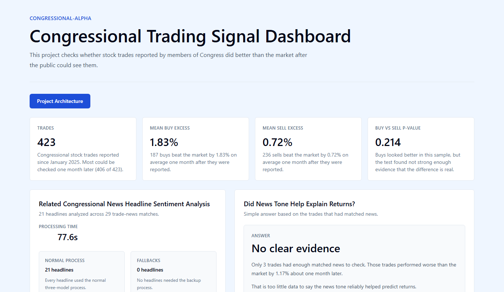
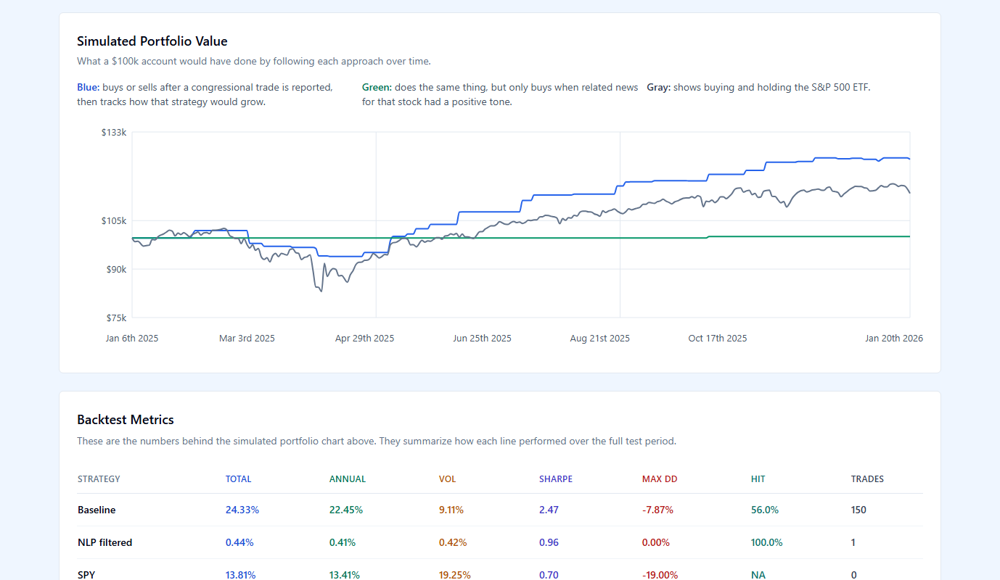
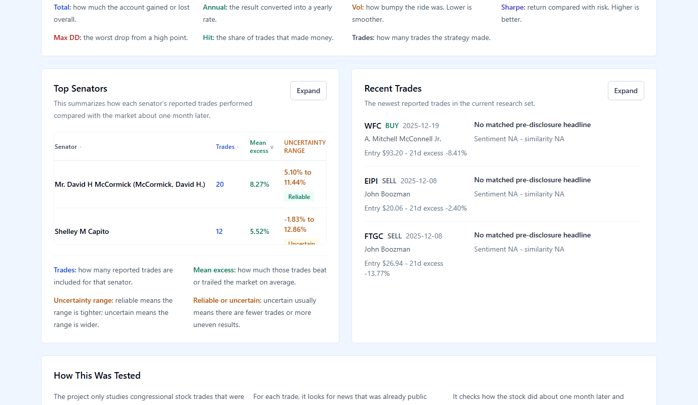
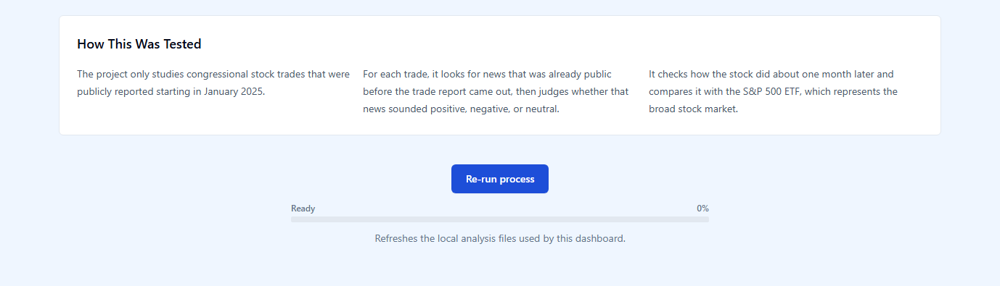
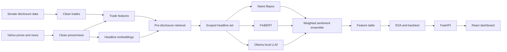

# congressional-alpha

A fully local, zero-cost research pipeline for testing whether congressional stock disclosures contain tradeable alpha after accounting for disclosure lag and pre-disclosure news.

## Dashboard Preview









## Thesis Question

When a congressional trade becomes public, can a simple post-disclosure strategy outperform SPY, and does local NLP over pre-disclosure news improve the signal enough to justify the extra machinery?

## Key Findings

- The January 2025 onward universe contains 423 disclosed trades, with 406 trades having usable 21-day forward returns.
- Buy trades averaged 1.83% 21-day excess return versus 0.72% for sells, but the buy/sell difference was not statistically strong (`p = 0.214`).
- The baseline post-disclosure strategy returned 24.33% total with a 2.47 Sharpe in this short sample, versus 13.81% for SPY.
- The NLP-filtered strategy only found 1 executable trade. Its result is not enough evidence for or against the NLP idea.
- News coverage is the main constraint: only 19 of 423 trades had at least one matched pre-disclosure headline, so the ensemble works technically but has very little signal to operate on.

## Architecture



## Methodology

The effective universe is congressional trades disclosed on or after January 1, 2025. That cutoff keeps trades and yfinance headlines in the same practical time window.

Lookahead control is enforced in two places. Trades enter on the next market signal date after disclosure, not on the transaction date. News retrieval only allows headlines published before the disclosure timestamp, so the NLP features do not see future news.

The NLP ensemble is intentionally local and scoped. It scores only the unique `news_id` values that appear in `trade_news_retrieval.parquet`, rather than the full news table. Every checked headline receives a weighted vote from Naive Bayes, FinBERT, and Ollama.

The backtest compares a baseline congressional-trade strategy, an NLP-filtered variant, and SPY. The current sample is too short for a robust train/test split, so the reported results should be treated as exploratory research, not a production trading system.

## Tech Stack

- Python, pandas, DuckDB, pyarrow
- yfinance, Senate disclosure data, GovTrades-compatible trade ingestion
- sentence-transformers, scikit-learn Naive Bayes, FinBERT, Ollama
- FastAPI and uvicorn
- React, TypeScript, Vite, Tailwind, Recharts
- Fully local and `$0` to run after dependencies and the Ollama model are installed

## Run Locally

1. Install `uv`, `pnpm`, `make`, and Ollama.
2. Pull the local LLM model:

   ```powershell
   ollama pull qwen2.5:0.5b
   ```

3. Install Python and frontend dependencies:

   ```powershell
   uv sync
   pnpm --dir frontend install
   ```

4. Rebuild the research artifacts:

   ```powershell
   make ingest
   make clean
   make nlp
   make features
   make research
   make backtest
   ```

5. Start the API and dashboard in separate terminals:

   ```powershell
   make api
   make frontend
   ```

6. Open `http://127.0.0.1:5173`.

## Repo Structure

```text
src/
  ingest/      raw congressional trades, prices, and news
  clean/       normalized parquet and DuckDB tables
  nlp/         embeddings, retrieval, NB/FinBERT/Ollama ensemble
  features/    return, sentiment, and disclosure-lag features
  research/    EDA and backtest artifacts
  api/         FastAPI endpoints for dashboard data
frontend/      React dashboard
data/          local raw, processed, embeddings, and results artifacts
tests/         focused regression tests
docs/assets/   README media
```

## Limitations

- yfinance news coverage is recent and uneven, which severely limits headline coverage for congressional trades.
- The 2025 onward sample is small, and the NLP-filtered backtest currently has only one trade.
- Ensemble weights are heuristic. They are engineered to be transparent, not optimized.
- Transaction amounts are ranges, so the backtest uses simplified position sizing rather than exact portfolio replication.
- With more time, I would add an actively maintained news corpus, expand the trade universe across House and Senate disclosures, add walk-forward validation, and stress-test slippage and liquidity assumptions.

## Author

Sader

Contact: use the repository owner profile or open an issue in the project repository.
